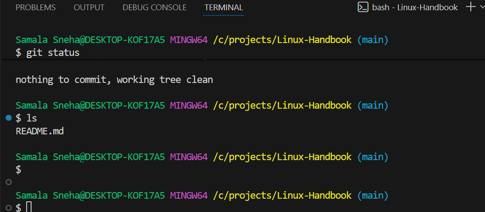

## Level 1 – Basic (Foundational Skills)

This level establishes the core prerequisites for security and development.

### 1. Set up Users, Groups for Dev Team

We will create a specific group (`devs`) and an application runtime user (`appxuser`) with no shell access for security.

```bash
# 1. Create the primary development group
sudo groupadd devs

# 2. Create standard dev users (e.g., alice, bob) and assign them to the group
sudo useradd -m -s /bin/bash alice
sudo useradd -m -s /bin/bash bob
sudo usermod -aG devs alice
sudo usermod -aG devs bob

# 3. Set up secure passwords for new users
sudo passwd alice
sudo passwd bob

# 4. Create a dedicated low-privilege application user (no shell access for security)
# -M: Do not create a home directory (optional, but cleaner for service users)
# -r: System user
# -s /sbin/nologin: Prevents interactive login
sudo useradd -r -M -s /sbin/nologin appxuser
```

**Verification:**

```bash
# Check group membership
id alice
# Expected output includes group 'devs'

# Check the application user's configuration
grep appxuser /etc/passwd
# Expected output: appxuser:x:998:998::/nonexistent:/sbin/nologin
```

### 2. Manage Permissions for Project Directories

We will create the core application installation directory (`/opt/appx`) and a source code directory (`/srv/appx_repo`).

```bash
# Create directories
sudo mkdir -p /opt/appx /srv/appx_repo

# Set the ownership of the application runtime directory to the application user
sudo chown -R appxuser:appxuser /opt/appx

# Set the source code directory ownership to the 'devs' group
sudo chown -R root:devs /srv/appx_repo

# Set permissions: Group members can read, write, execute (needed for git clone)
# 2770: 2 (sets the sticky bit, files/dirs created inherit group ownership)
sudo chmod 2770 /srv/appx_repo
```

### 3. Install Required Packages

We install the version control, web server, and application runtime environment.

```bash
# Install Git and Nginx
sudo apt install git nginx -y

# Install Java (OpenJDK 17 for modern application stack)
sudo apt install openjdk-17-jdk -y

# Verify installations
git --version
nginx -v
java -version

# Ensure services are started and enabled on boot
sudo systemctl start nginx
sudo systemctl enable nginx
```

### 4. Check System Info

Essential commands for initial resource baseline and troubleshooting.

```bash
# Check Memory usage (Human readable)
free -h

# Check CPU information (Count, Model, Architecture)
lscpu

# Check Disk usage and filesystem mount points
df -h

# Check block devices (physical disks)
lsblk

# View kernel messages (good for hardware issues)
dmesg | less
```

---

## Level 2 – Intermediate (Daily DevOps Tasks)

This level focuses on automation, maintenance, and basic monitoring.

### 1. Automate Backups with Cron

We will create a daily cron job to compress and archive the application configuration files and logs. We will store backups in `/var/backups/appx`.

```bash
# 1. Create the backup destination directory
sudo mkdir -p /var/backups/appx

# 2. Create the backup script (appx_backup.sh)
cat << 'EOF' | sudo tee /usr/local/bin/appx_backup.sh
#!/bin/bash
BACKUP_DIR="/var/backups/appx"
CONFIG_DIR="/etc/nginx /opt/appx/config" # Example config paths
DATE=$(date +%Y%m%d%H%M)
BACKUP_FILE="${BACKUP_DIR}/appx_config_${DATE}.tar.gz"

echo "Starting application configuration backup..."
tar -czvf $BACKUP_FILE $CONFIG_DIR
find $BACKUP_DIR -type f -mtime +7 -name '*.tar.gz' -delete
echo "Backup complete. Old backups cleaned up."
EOF

# 3. Make the script executable
sudo chmod +x /usr/local/bin/appx_backup.sh

# 4. Schedule the job using the root crontab (runs daily at 3:00 AM)
sudo crontab -e
# Add the following line:
# 0 3 * * * /usr/local/bin/appx_backup.sh > /dev/null 2>&1
```

### 2. Create Shell Scripts

We create three utility scripts and place them in `/usr/local/sbin`.

#### Script A: Log Cleanup (`cleanup_logs.sh`)

Removes all files ending in `.log` older than 14 days from a specific directory (`/var/log/appx`).

```bash
sudo mkdir -p /var/log/appx
cat << 'EOF' | sudo tee /usr/local/sbin/cleanup_logs.sh
#!/bin/bash
LOG_DIR="/var/log/appx"
RETENTION_DAYS="+14"

echo "Cleaning up logs older than ${RETENTION_DAYS} days in ${LOG_DIR}..."
find ${LOG_DIR} -type f -name "*.log" -mtime ${RETENTION_DAYS} -exec rm {} \;
echo "Cleanup finished."
EOF
sudo chmod +x /usr/local/sbin/cleanup_logs.sh
```

#### Script B: Service Restart (`restart_appx.sh`)

Gracefully restarts the custom application service (we assume we have defined the `appx.service` later in Level 3).

```bash
cat << 'EOF' | sudo tee /usr/local/sbin/restart_appx.sh
#!/bin/bash
SERVICE="appx"

echo "Attempting graceful restart of ${SERVICE}..."
sudo systemctl restart ${SERVICE}

if systemctl is-active --quiet ${SERVICE}; then
    echo "${SERVICE} restarted successfully."
else
    echo "ERROR: ${SERVICE} failed to restart. Checking status..."
    sudo systemctl status ${SERVICE} --no-pager
fi
EOF
sudo chmod +x /usr/local/sbin/restart_appx.sh
```

#### Script C: Health Check (`appx_healthcheck.sh`)

Checks if the AppX process is running and if the exposed Nginx port (80) is listening.

```bash
cat << 'EOF' | sudo tee /usr/local/sbin/appx_healthcheck.sh
#!/bin/bash
APP_NAME="java" # Assuming a generic Java process name
PORT=80
STATUS=0

# Check 1: Process running
if ps aux | grep -v grep | grep -q "${APP_NAME}"; then
    echo "AppX process running: OK"
else
    echo "AppX process NOT running: FAIL"
    STATUS=1
fi

# Check 2: Network port listening
if ss -tuln | grep -q ":${PORT}"; then
    echo "Port ${PORT} is listening: OK"
else
    echo "Port ${PORT} NOT listening: FAIL"
    STATUS=1
fi

exit $STATUS
EOF
sudo chmod +x /usr/local/sbin/appx_healthcheck.sh
```

### 3. Manage Logs under /var/log

Standard actions for inspecting system and service logs.

```bash
# View the last 10 lines of the main system log
tail /var/log/syslog

# Follow Nginx access logs in real-time
tail -f /var/log/nginx/access.log

# Use journalctl to view logs for a specific service (Nginx)
# -u: unit, -f: follow, --since: time constraint
sudo journalctl -u nginx.service --since "1 hour ago"

# View boot logs (useful for diagnosing boot-time failures)
journalctl -b 0
```

### 4. Monitor System Performance and Troubleshoot Services

Using common diagnostic utilities.

```bash
# Interactive Process Viewer (must install htop first: sudo apt install htop)
htop

# Network troubleshooting: Show open listening sockets (TCP, UDP, Numeric)
ss -tuln

# Detailed network connection statistics
netstat -s

# Troubleshooting: Which process is using port 80?
sudo lsof -i :80

# Check load average and running processes
uptime

# Display I/O statistics (useful for disk bottleneck diagnosis)
iostat -x 5
```

---

## Level 3 – Advanced (Production-Ready Linux Admin)

This level focuses on security, stability, and enterprise features.

### 1. Create Custom Systemd Service for Your Application

This ensures AppX starts correctly, runs under the correct user, and recovers automatically upon failure. We assume the application binary is `/opt/appx/appx.jar`.

**Service File: `/etc/systemd/system/appx.service`**

```bash
cat << EOF | sudo tee /etc/systemd/system/appx.service
[Unit]
Description=AppX Java Microservice
After=network.target

[Service]
User=appxuser
Group=appxuser
# The application JAR location
ExecStart=/usr/bin/java -jar /opt/appx/appx.jar
# Restart policy: If the process exits unexpectedly, restart it
Restart=always
RestartSec=5s
StandardOutput=journal
StandardError=journal
SuccessExitStatus=143

[Install]
WantedBy=multi-user.target
EOF

# Command sequence to activate the service:
sudo systemctl daemon-reload           # Reload systemd configuration
sudo systemctl start appx.service      # Start the service
sudo systemctl enable appx.service     # Enable the service to start on boot

# Verification:
sudo systemctl status appx.service
```

### 2. SSH Hardening for Security

We secure the server by disabling root login and password authentication, forcing users to rely on SSH keys. We also change the default SSH port (e.g., to 2222).

**Configuration File: `/etc/ssh/sshd_config`**

```bash
# Backup the original config
sudo cp /etc/ssh/sshd_config /etc/ssh/sshd_config.bak

# Use sed to modify critical security parameters
sudo sed -i 's/^#Port 22/Port 2222/' /etc/ssh/sshd_config
sudo sed -i 's/^PermitRootLogin yes/PermitRootLogin no/' /etc/sshd_config
sudo sed -i 's/^#PasswordAuthentication yes/PasswordAuthentication no/' /etc/ssh/sshd_config

# Ensure Key Authentication is explicitly enabled (usually default, but good practice)
sudo sed -i 's/^#PubkeyAuthentication yes/PubkeyAuthentication yes/' /etc/ssh/sshd_config

# Restart the SSH service to apply changes
sudo systemctl restart sshd

# Verification (from another terminal):
# Try logging in using the new port (assuming you have set up keys):
# ssh -p 2222 alice@<server_ip>
```

### 3. LVM Setup for Storage Scaling

We simulate adding a new physical volume (`/dev/sdb`), setting up LVM, and mounting it as a large data volume (`/mnt/appdata`).

*(Note: This requires a secondary disk device, e.g., `/dev/sdb`, to be attached to the VM/server.)*

**a. Prepare the disk:**

```bash
# Use fdisk to partition the new disk /dev/sdb, setting type to 'Linux LVM' (code 8e)
sudo fdisk /dev/sdb
# (Commands inside fdisk: n (new partition), p (primary), default sectors, t (change type), 8e (LVM), w (write))

# Scan and display partitions
sudo partprobe
lsblk
```

**b. Create Physical Volume (PV), Volume Group (VG), and Logical Volume (LV):**

```bash
# 1. Initialize the physical volume
sudo pvcreate /dev/sdb1

# 2. Create the Volume Group named 'vg_app'
sudo vgcreate vg_app /dev/sdb1

# 3. Create the Logical Volume named 'lv_data' with 50GB size (adjust size as needed)
sudo lvcreate -n lv_data -L 50G vg_app

# 4. View LVM structure
sudo vgs
sudo lvs
```

**c. Format and Mount:**

```bash
# 1. Format the new logical volume
sudo mkfs.ext4 /dev/vg_app/lv_data

# 2. Create mount point and mount it
sudo mkdir -p /mnt/appdata
sudo mount /dev/vg_app/lv_data /mnt/appdata

# 3. Add to fstab for persistent mounting (use UUID or LV path)
echo "/dev/vg_app/lv_data /mnt/appdata ext4 defaults 0 0" | sudo tee -a /etc/fstab

# Verification
df -h /mnt/appdata
```

**d. Demonstration of Scaling (LVM Extend):**
If we need to expand `lv_data` by 10GB:

```bash
# Extend the Logical Volume by 10G
sudo lvextend -L +10G /dev/vg_app/lv_data

# Resize the filesystem to utilize the new space immediately
sudo resize2fs /dev/vg_app/lv_data

# Verification
df -h /mnt/appdata
```

### 4. Configure Firewall Rules (UFW)

Assuming UFW (Uncomplicated Firewall) is used for its simplicity. We ensure only necessary ports are open, including the custom SSH port (2222).

```bash
# Reset rules to clean slate (if necessary)
# sudo ufw reset

# Allow standard web traffic
sudo ufw allow 80/tcp
sudo ufw allow 443/tcp

# Allow standard SSH (if we hadn't changed the port yet)
# sudo ufw allow 22/tcp

# Allow custom SSH port (2222)
sudo ufw allow 2222/tcp

# Allow the internal application port (e.g., 8080, if Nginx proxies to it)
sudo ufw allow 8080/tcp

# Enable the firewall
sudo ufw enable

# Verification
sudo ufw status verbose
```

### 5. Implement Logrotate for App Logs

To prevent the custom application log file (e.g., `/var/log/appx/appx.log`) from filling the disk, we set up `logrotate`.

**Logrotate Configuration File: `/etc/logrotate.d/appx`**

```bash
# Ensure the custom log directory exists (where application logs are written)
sudo mkdir -p /var/log/appx
sudo touch /var/log/appx/appx.log
sudo chown appxuser:appxuser /var/log/appx/appx.log

cat << 'EOF' | sudo tee /etc/logrotate.d/appx
/var/log/appx/*.log {
    daily                # Rotate once a day
    size 100M            # Or rotate if file exceeds 100MB
    rotate 7             # Keep 7 rotated logs
    compress             # Compress the old log files
    delaycompress        # Compress everything except the most recent log
    missingok            # Don't throw an error if the log file is missing
    notifempty           # Don't rotate if the log file is empty
    create 0640 appxuser appxuser # Create a new log file with specific permissions/owner
    
    # Prerotate/Postrotate scripts are crucial for services writing continuously
    postrotate
        # Gracefully tell systemd to re-open the log file stream 
        # (This is important for applications that hold an open file handle)
        systemctl reload appx.service > /dev/null 2>&1 || true
    endscript
}
EOF

# Verification (Dry Run):
# Run logrotate in debug mode to ensure the configuration is valid
sudo logrotate -d /etc/logrotate.d/appx
```

---
*(End of comprehensive setup simulation)*

